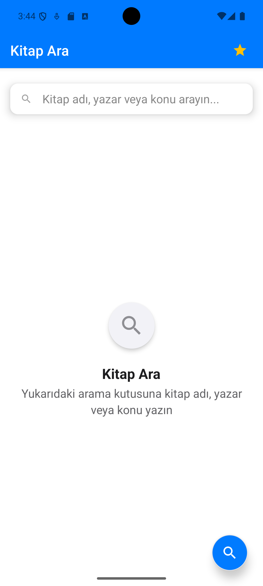
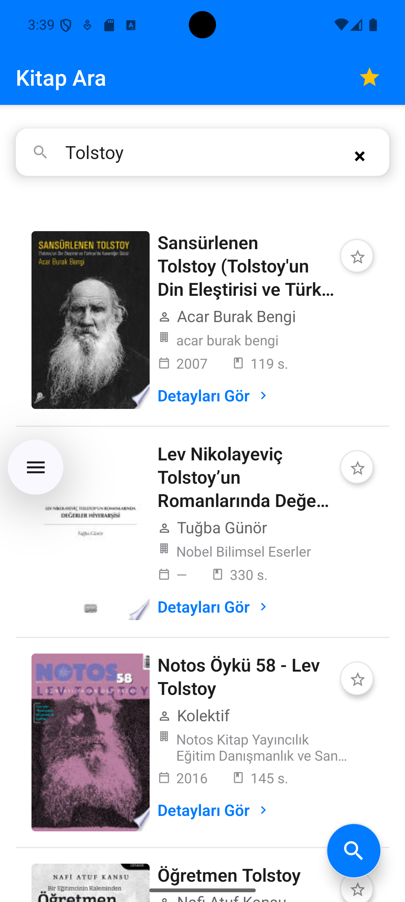
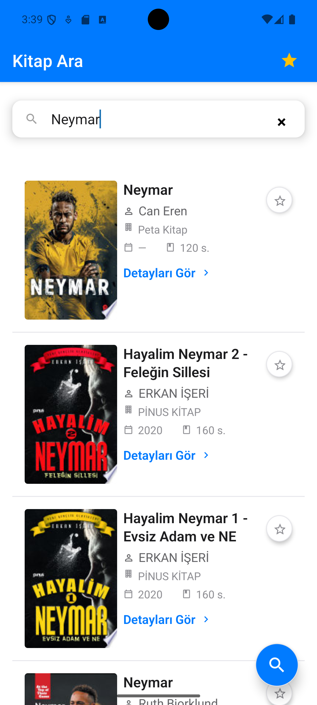
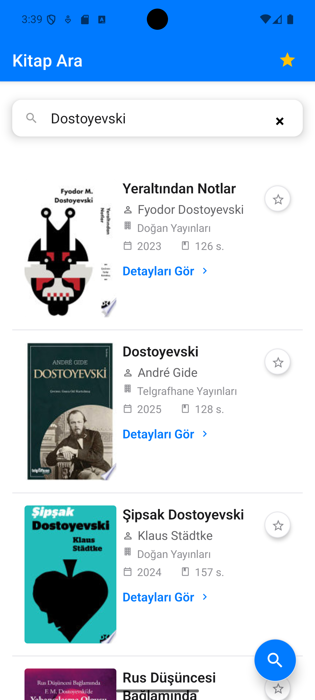
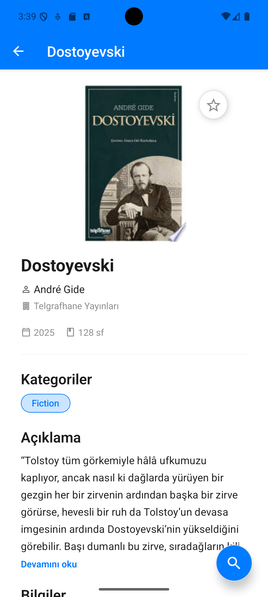
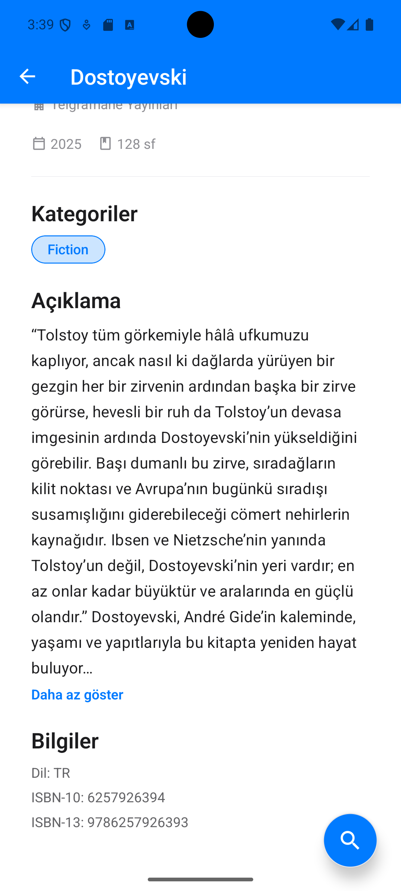
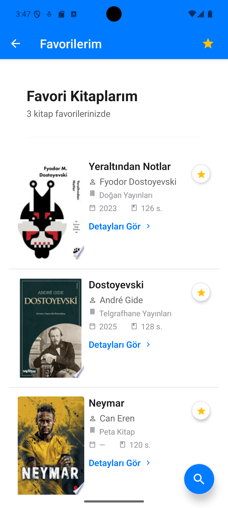

# Qampus Books — Kitap Arama ve Favorilere Ekleme Uygulaması

Modern, ölçeklenebilir ve katmanlı mimariye sahip bir Expo React Native uygulaması. Google Books API üzerinden kitap arama, otomatik sayfalama, detay görüntüleme ve favorilere ekleme/çıkarma özellikleri sunar. Tüm hata mesajları Türkçe’dir.

## İçindekiler
- [Kurulum](#kurulum)
- [Kullanım](#kullanım)
- [Özellikler](#özellikler)
- [Mimari ve Dizin Yapısı](#mimari-ve-dizin-yapısı)
- [Teknik Detaylar](#teknik-detaylar)
- [Komutlar](#komutlar)
- [Notlar](#notlar)
- [Ekran Görüntüleri](#ekran-görüntüleri)

---

## Kurulum
1) Gerekli sürümler (Expo SDK 53 uyumlu):
   - node >= 18, npm >= 9
   - Expo Go (iOS/Android mağazalarından)
2) Bağımlılıkları yükleyin:
```bash
cd qampus-books
npm install
```
3) Geliştirme sunucusunu başlatın (cache temiz önerilir):
```bash
npx expo start -c
```
4) Çalıştırma:
- iOS (Expo Go): QR ile açın veya `i`
- Android (Expo Go): `a`
- Web: `w`

> Paket sürümleri `package.json` içinde Expo SDK 53 ile uyumlu olacak şekilde sabitlenmiştir.

---

## Kullanım
- Ana ekranda arama çubuğuna yazın; yazma bittikten ~2.5 sn sonra akıllı arama tetiklenir.
- Sonuç listesi sonuna yaklaşınca otomatik sayfalama devreye girer.
- Kart üzerine dokunarak kitap detayına gidin.
- Detay ekranının sağ üstündeki yıldız butonu ile favorilere ekleyin/çıkarın.
- Alt-sağdaki “arama” kısa yolu (FAB) ile her ekrandan arama sayfasına dönebilirsiniz.
- Favoriler ekranında eklediklerinizi görüntüleyin.

> Favoriler AsyncStorage’da saklanır ve uygulama açılışında otomatik yüklenir.

---

## Özellikler
- Akıllı arama: 2.5 sn debounce, yazma takibi, latest-only yanıt işleme, iptal edilebilir istekler
- Otomatik sayfalama: `FlatList` + `onEndReached` (10’ar 10’ar, tekrar eden sonuçlar de-dupe)
- Hata yönetimi: Ağ/zaman aşımı/HTTP için Türkçe, kullanıcı dostu mesajlar
- Favoriler: Context + Reducer, normalized state (`byId`, `allIds`), kalıcı saklama (AsyncStorage)
- Tasarım: Minimal–premium kartlar, okunabilir tipografi, iOS/Android uyumlu
- Erişilebilirlik: Temel `accessibilityLabel/Role`, dokunma alanları ve odak hiyerarşisi

---

## Mimari ve Dizin Yapısı
Katmanlı mimari: `UI/screens/components ↔ hooks ↔ domain ↔ data(api&storage) ↔ state ↔ theme ↔ utils`

```text
src/
  app/                # Navigation, AppProvider
  components/
    book/             # BookCard, BookCover, FavoriteToggle
    common/           # Loading, EmptyState, ErrorState
  data/
    api/              # http (Axios), googleBooks client
    storage/          # AsyncStorage wrapper (favorites)
  domain/             # bookMapper, bookSchema
  hooks/              # useBookSearch (debounce, sayfalama, iptal)
  screens/
    Search/
    BookDetail/
    Favorites/
  state/
    favorites/        # Context + Reducer + hook
  theme/              # Renkler, boşluklar, tipografi, globalStyles
  utils/              # debounce, format, image
```

---

## Teknik Detaylar
- HTTP: Axios + `AbortController`, `TimeoutError`/`NetworkError`/`HttpError`, exponential backoff retry
- Google Books API: `volumes` araması (TR dil önceliği), detay genişletilebilir
- useBookSearch:
  - Debounce (2.5s) – yazma sırasında UI bloklanmaz
  - SWR benzeri kısa süreli cache, latest-only yanıt işleme, iptal
  - Otomatik sayfalama ve de-dupe (`mergeUniqueById`)
- Favoriler: Normalized veri; persist/rehydrate; güvenli hata işleme
- Görseller: HTTPS’e yükseltme, `resizeMode="cover"`, yer tutucu
- İkonlar: MaterialCommunityIcons (Expo Go uyumlu)

---

## Komutlar
```jsonc
// package.json (özet)
{
  "scripts": {
    "start": "expo start",
    "android": "expo start --android",
    "ios": "expo start --ios",
    "web": "expo start --web",
    "lint": "eslint . --ext .js,.jsx",
    "lint:fix": "eslint . --ext .js,.jsx --fix",
    "format": "prettier --write \"**/*.{js,jsx,json,md}\""
  }
}
```

---

## Notlar
- Expo SDK: 53 (sürümler uyumlu). Sorunlarda: `npx expo doctor`, `npx expo start -c`.
- Hata mesajları Türkçe.
- Gereksiz yorumlar temizlenmiştir; yalnızca anlamlı kısa yorumlar kalan yapıda kodlanmıştır.
- UI/UX: floating arama çubuğu, tam genişlik kartlar, iOS/Android’de hizalı favori yıldızı.

---

## Ekran Görüntüleri

### Arama Ekranı
<p>
  
  
  
</p>

<p>
  
</p>

### Kitap Detay
<p>
  
  
</p>

### Favoriler
<p>
  
</p>
